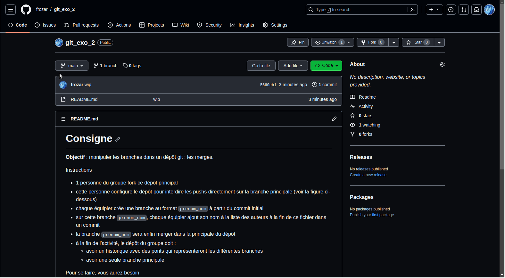

# Consigne

**Objectif** : gérer les merges vers la branche principale : les Pull Request GitHub.

Instructions
 - 1 personne du groupe fork ce dépôt principal
 - la personne qui crée le fork doit ajouter ces collègues comme collaborateur du dépôt
 - chaque collaborateur crée une branche au format `prenom-nom` à partir du commit initial
 - à partir de sa branche `prenom-nom`, chaque collaborateur va ajouter son prénom/nom à la liste des auteurs dans le fichier `authors.txt` dans un commit
 - `chaque collaborateur propage sa branche 'prenom-nom' sur le dépôt distant`
 - `chaque collaborateur crée une Pull Request sur Github pour merger sa branche 'prenom-nom' avec la branche main distante`
 - `les collaborateurs qui n'ont pas encore accepter leur Pull Request auront un conflit à résoudre. Pour résoudre ce conflit, le collaborateur doit`:
   1. `mettre à jour sa branche main locale`
   2. `récupérer les contributions de sa branche main dans sa branche 'prenom-nom' locale à l'aide d'un merge`
   3. `propager sa branche 'prenom-nom' sur le dépôt distant`
   4. `une fois ces étapes réalisées, Github verra que la branche 'prenom-nom' ne présente plus de conflit et l'acceptera`
 - à la fin de l'activité, le dépôt du groupe doit :
   - avoir un historique avec des ponts qui représentent les différentes branches
   - avoir une seule branche principale

Pour se faire, vous aurez besoin de l'ensemble des savoirs des workshops précédents, plus les commandes git suivantes :
 - **push -u** : propager une branche sur un dépôt distant en configurant la branche distante à tracker
 - savoir créer des Pull Requests sur GitHub

Lisez les sections de la "Boite à outils" pour réaliser cet exercice.

## Dans l'historique de commits

Une fois que les différentes branches `prenom-nom` seront créées et propagées sur le 
dépôt distant, vous devriez voir un historique similaire à celui-ci :


Une fois que toutes les Pull Requests sont acceptées, vous devriez voir un histoirique
similaire à celui-ci, avec les différents pont représentant les différents merges :


Visualisez les changements de l'historique des commits après chaque commande git.

## Bilan

Vous savez maintenant travailler à plusieurs sur un dépôt GitHub et utiliser des 
Pull Requests pour merger vos branches dans la branche principale. Les efforts
de développement sont maintenant distribués.

**Remarque 1** : dans ce workflow, n'y a pas plus de synchronisation entre les développeurs, mais il y a des conflits à résoudre, comme dans le workshop précédent.
La différence avec le workshop précédent est que l'utilisation de Pull Request 
permet à Github de nous informer de potentiels conflits à résoudre. 
Une autre différence est que la résolution de conflits se fait sur la branche 
`prenom-nom`, et non plus sur la branche `main` directement.

**Remarque 2** : la lecture de l'historique de commits devient compliquée. La 
multiplication des ponts entre les branches compliquent l'interprétation des 
différents commits.

# Boite à outils

## Interdire les pushs directement sur la branche main



## Comment créer une Pull Request sur GitHub ?

## Comment supprimer une branche distante ?

Si vous n'avez pas demandé la supprimession de la branche distante lors de la Pull 
Request, vous avez certainement plusieurs branches qui sont toujours présentent sur 
votre dépôt distant alors qu'elles ont été mergées dans la branche main. Vous pouvez le 
voir dans git-graph avec la mention `| origin` accolé au nom des branches.

Pour supprimer une branche sur votre dépôt distant, vous pouvez taper :
```
git push origin :<nom-de-branche>
```
